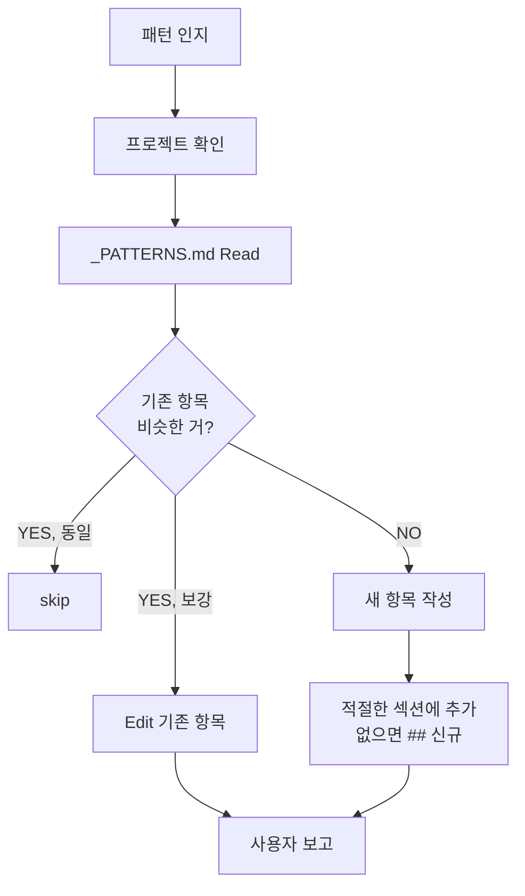

# ob-memory-update-pattern

## When to Use
- 특정 프로젝트에서 재사용되는 코드·SQL·명령 패턴 발견
- 관례·관용 표현·자주 쓰는 trick
- 일회성 정답이 아니라 **패턴**

## Algorithm



## Steps

1. **프로젝트 식별** (작업 컨텍스트 또는 사용자 명시)

2. **기존 _PATTERNS.md Read**:
   ```
   300-resources/memory/projects/{project}/_PATTERNS.md
   ```

3. **중복/보강 판단**:
   - 동일 패턴 → skip
   - 비슷한 패턴 → 기존 항목 보강 (Edit)
   - 새 패턴 → 새 섹션 추가

4. **항목 작성** (한국어, 코드 블록 포함):
   ```markdown
   ## {패턴 이름}

   {언제 쓰는지 1~2 문장}

   ### 예시
   \`\`\`{언어}
   {코드/SQL/명령}
   \`\`\`

   ### 주의
   - {함정·제약}

   사례: [{날짜}] {적용된 곳}
   ```

5. **Edit/Write 실행**:
   - 새 항목: 파일 끝 또는 카테고리 섹션 안에 append
   - 보강: 해당 항목 Edit

6. **사용자 보고**

## Common Mistakes
- ❌ 일회성 코드 스니펫을 패턴으로 (재사용 가능한 것만)
- ❌ 함정/금지(GOTCHAS)를 PATTERNS에 (잘못된 분류)
- ❌ 코드 블록 없이 산문 설명만
- ❌ 언어 명시 안 함 (\`\`\`bash 같은 syntax 누락)
- ❌ 중복 검사 없이 새 항목 추가

## Difference from _GOTCHAS

| 항목 | PATTERNS | GOTCHAS |
|------|----------|---------|
| **목적** | "이렇게 하면 됨" (긍정) | "이건 하지 마" (부정) |
| **편집** | Edit/Append 혼합 | Append only |
| **예** | "DDL은 node pg 스크립트로" | "*_hists DELETE 금지" |

## Files / Tools
- **Tools**: Read, Edit, Write
- **수정 대상**: `300-resources/memory/projects/{project}/_PATTERNS.md`

## Related
- [[ob-memory-add-gotcha]] — 함정 (반대 영역)
- [[ob-memory-update-project]] — 프로젝트 마스터 (다른 영역)
