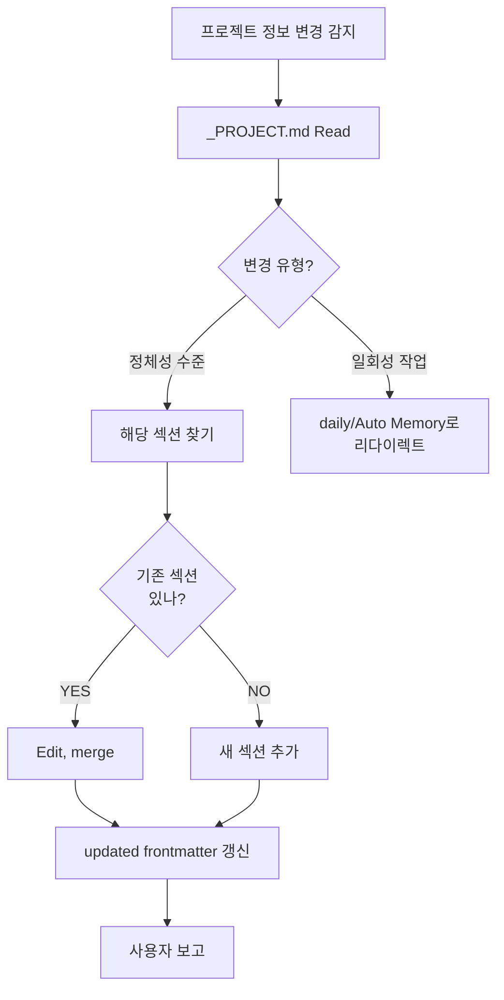

# ob-memory-update-project

## When to Use
- 프로젝트의 기본 정체성·아키텍처 변화 감지
- 기술 스택 추가/제거
- 주요 모듈 추가
- 데이터 모델 핵심 변경

## Algorithm



## Steps

1. **변경 유형 판단**:
   - **정체성 수준**: 기술 스택, 클라이언트, 주 모듈, 데이터 모델 SoT, 인증 방식, 패키징
   - **일회성 작업**: 특정 버그 수정, 한 번 한 마이그레이션
   - 후자는 이 skill 거부 + daily/Auto Memory 안내

2. **_PROJECT.md Read**:
   ```
   300-resources/memory/projects/{project}/_PROJECT.md
   ```

3. **기존 섹션 매칭**:
   - 변경 내용이 어느 섹션에 속하는지 (예: `## 기술 스택`, `## 데이터 모델 핵심`)
   - 없으면 적절한 위치에 새 섹션

4. **Edit (merge 방식)**:
   - 기존 정보는 가능한 보존
   - 새 정보로 갱신/추가
   - 모순되면 **사용자에게 확인** ("X였는데 Y로 바뀐 거 맞나요?")

5. **frontmatter `updated` 갱신**:
   ```yaml
   updated: {YYYY-MM-DD}
   ```

6. **사용자 보고**: 변경된 섹션 + diff 요약

## Common Mistakes
- ❌ 일회성 작업을 _PROJECT.md에 기록 (이건 daily 또는 _PATTERNS)
- ❌ 모순 발견 시 자동 덮어쓰기 (사용자 확인 필수)
- ❌ updated 갱신 누락
- ❌ 다른 프로젝트의 _PROJECT.md 잘못 수정
- ❌ 함정/금지를 _PROJECT.md에 (이건 _GOTCHAS)

## Files / Tools
- **Tools**: Read, Edit
- **수정 대상**: `300-resources/memory/projects/{project}/_PROJECT.md`

## Related
- [[ob-memory-add-gotcha]] — 함정 (다른 영역)
- [[ob-memory-update-pattern]] — 패턴 (다른 영역)
