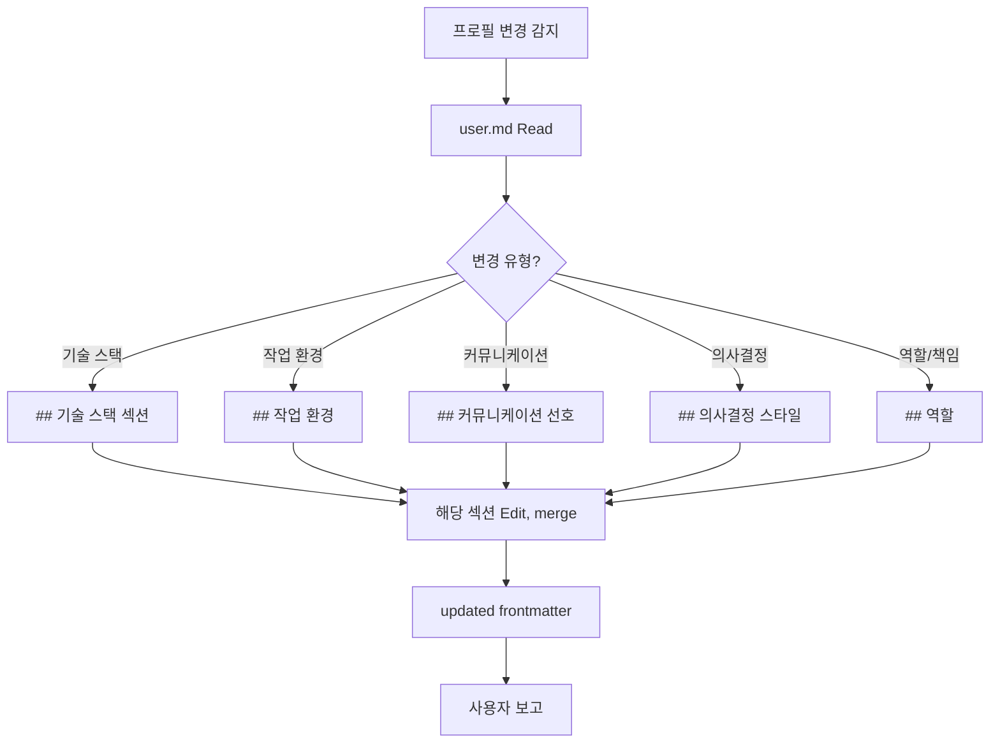

# ob-user-profile-update

## When to Use
- 사용자가 새 기술 스택 학습/도입
- 작업 환경 변경 (새 기기 추가, 셸 변경)
- 커뮤니케이션 선호 변경
- 의사결정 스타일 표명

## Algorithm



## Steps

1. **user.md Read**: `300-resources/memory/user.md`

2. **변경 섹션 매칭**:
   - **`## 역할`**: 역할, 직책, 책임 범위
   - **`## 기술 스택`**: 자주 쓰는 언어·프레임워크·도구
   - **`## 작업 환경`**: 기기, OS, 셸, Vault 위치
   - **`## 커뮤니케이션 선호`**: 언어, 톤, 응답 형식
   - **`## 의사결정 스타일`**: 사고 방식, 선호 패턴

3. **Edit (merge)**:
   - 기존 항목 보존
   - 새 정보 추가
   - 모순이면 사용자 확인

4. **frontmatter 갱신** (있으면):
   ```yaml
   updated: {YYYY-MM-DD}
   ```

5. **사용자 보고**: 어느 섹션이 어떻게 갱신됐는지

## Common Mistakes
- ❌ 일회성 발언을 프로필로 (지속성 있는 선호만)
- ❌ feedback과 혼동 (feedback은 교정·재발 방지, profile은 정체성)
- ❌ 잘못된 섹션에 추가
- ❌ 사용자 확인 없이 모순 덮어쓰기
- ❌ 기존 정보 삭제 (보통 추가만, 명시적 요청 시에만 삭제)

## Difference from feedback

| 항목 | user.md | feedback/ |
|------|---------|----------|
| **목적** | 사용자 정체성·선호 (positive) | Claude 작업 교정 (corrective) |
| **예** | "Spring 개발자", "한국어 우선" | "users 필터 추가하지 마" |
| **편집** | Edit (merge) | 파일 분리 |

## Files / Tools
- **Tools**: Read, Edit
- **수정 대상**: `300-resources/memory/user.md`

## Related
- [[ob-memory-save-feedback]] — 교정 피드백 (다른 영역)
- [[13_memory-architecture]] — 3-Layer Memory
