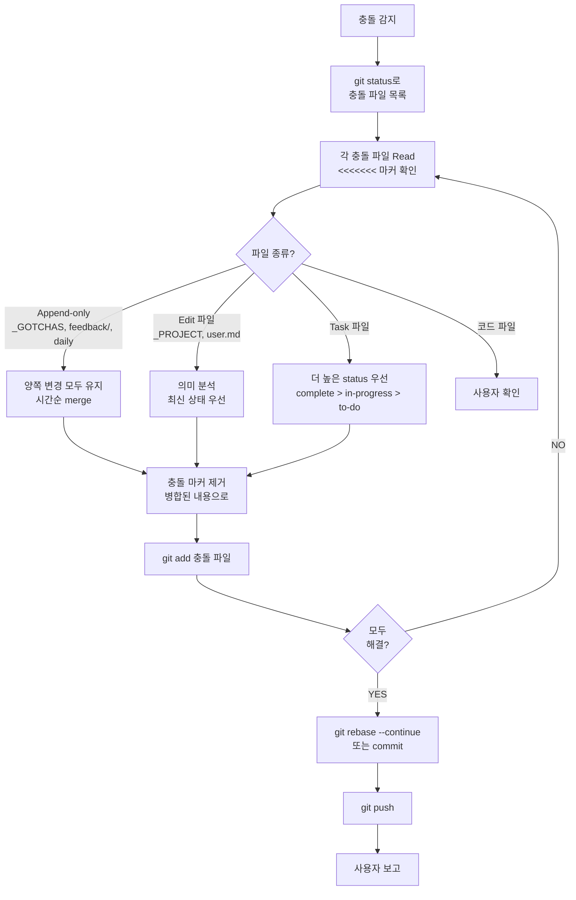

# ob-vault-conflict-resolve

## When to Use
- `git pull --rebase` 실패
- on-stop.sh의 자동 push 실패
- 사용자가 충돌 해결 요청

## Algorithm



## Steps

1. **충돌 파일 목록**:
   ```bash
   cd <vault> && git status
   # "both modified" 라인 확인
   ```

2. **각 파일 Read** → conflict marker (`<<<<<<<`, `=======`, `>>>>>>>`) 위치 확인

3. **파일 종류별 전략**:

   **Append-only** (`_GOTCHAS.md`, `feedback/*.md`, daily 노트):
   - 양쪽 변경 모두 유지 (다른 항목이라서 충돌 자체가 드뭄)
   - 시간 순으로 정렬
   - 중복 항목만 제거

   **Edit 파일** (`_PROJECT.md`, `user.md`, hub 노트):
   - 의미 분석: 두 변경이 양립 가능하면 양쪽 반영
   - 양립 불가하면 **최신 commit 시간** 또는 사용자 확인
   - frontmatter는 보통 최근 갱신 우선

   **Task 파일** (`160-tasks/`):
   - frontmatter `status`: `complete > in-progress > to-do` 우선
   - body는 더 풍부한 내용 우선

   **코드 파일** (`code/`):
   - 자동 처리 위험 → 사용자 확인 필수

4. **충돌 마커 제거**: Edit으로 `<<<<<<<` `=======` `>>>>>>>` 모두 제거, 병합된 내용만 남김

5. **`git add`**:
   ```bash
   git add {해결된 파일}
   ```

6. **rebase 또는 commit 완료**:
   ```bash
   git rebase --continue
   # 또는 일반 merge였다면
   git commit
   ```

7. **push**:
   ```bash
   git push
   ```

8. **사용자 보고**: 해결한 파일 목록 + 적용 전략 + 충돌 원인 추정

## Common Mistakes
- ❌ Append-only 파일에서 한쪽만 채택 (양쪽 다 유지해야 함)
- ❌ 코드 파일을 사용자 확인 없이 자동 머지
- ❌ conflict marker 일부만 제거 (전부 제거해야)
- ❌ `git add` 전에 `git rebase --continue` 시도
- ❌ frontmatter 충돌 시 아무 쪽이나 (최신 갱신이 우선)
- ❌ 푸시 후 사용자에게 알림 누락

## Recovery (복구 옵션)

해결 중 잘못되면:
```bash
git rebase --abort      # rebase 중단
git merge --abort       # merge 중단
git reset --hard HEAD@{1}  # 직전 상태로
```

## Files / Tools
- **Tools**: Bash (git), Read, Edit
- **수정 대상**: 충돌 발생한 파일 모두

## Related
- ADR-0003 — Stop hook git 통합 결정
- on-stop.sh의 `git pull --rebase --autostash` 로직
